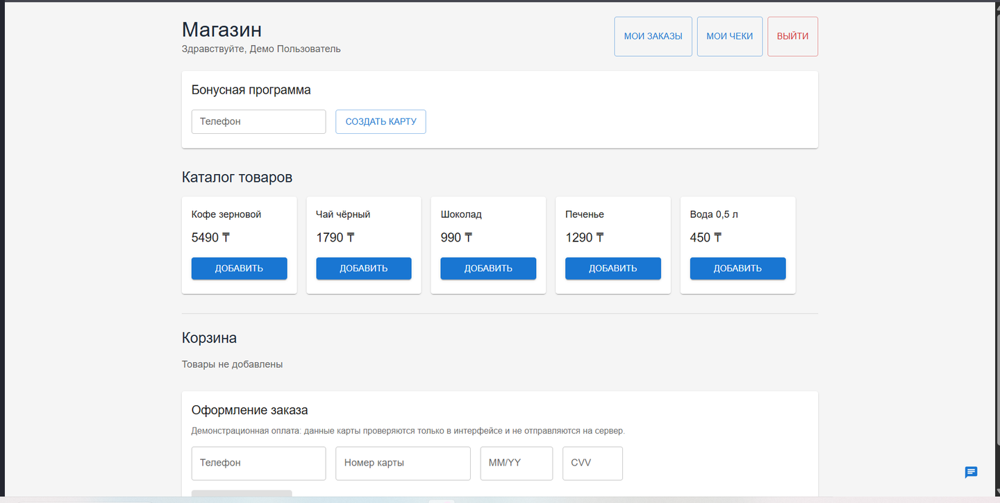
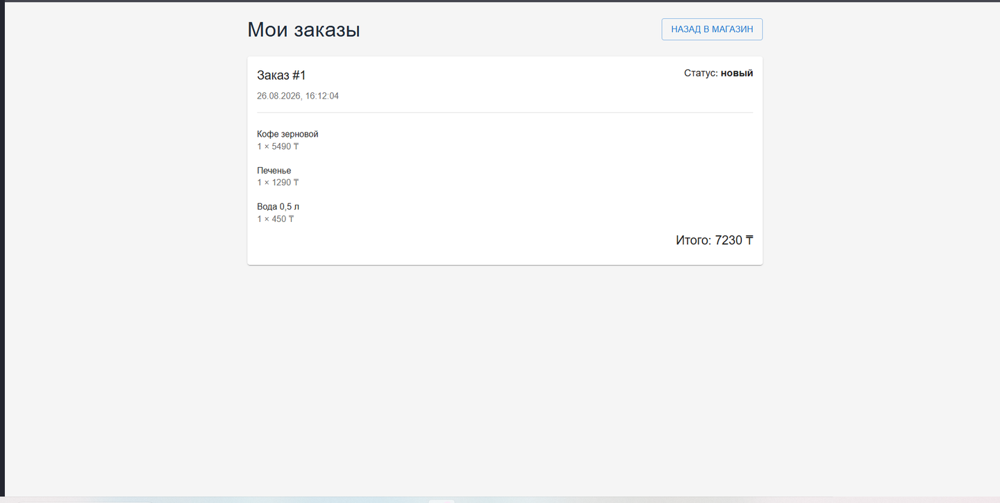
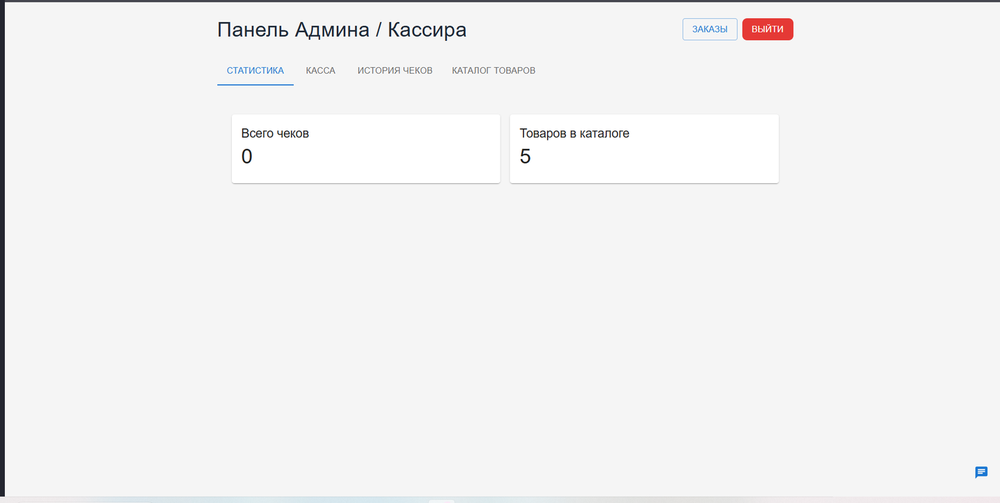
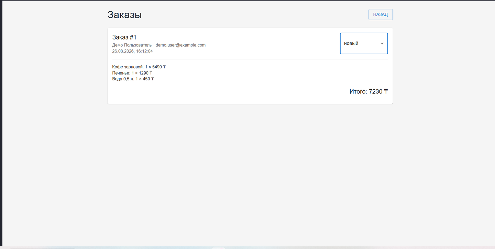

# Retail Shop Demo

Демонстрационное full-stack веб-приложение для розничного магазина. Проект включает пользовательскую часть, панель администратора/кассира, работу с заказами, кассовыми чеками и бонусной программой.

## Стек

**Frontend:** React 18, Material UI, React Router, Axios, Socket.IO Client, html5-qrcode.

**Backend:** Node.js, Express, PostgreSQL, Sequelize, JWT, Socket.IO.

## Возможности

### Пользователь

- регистрация и авторизация;
- каталог товаров;
- серверная корзина с изменением количества;
- оформление заказа и история заказов;
- отображение статуса заказа;
- бонусная карта с номером и балансом;
- история чеков;
- чат с поддержкой;
- демонстрационная форма оплаты.

### Администратор / кассир

- отдельная зона с проверкой роли на сервере;
- базовая статистика;
- просмотр каталога;
- сканирование QR-кода/кода товара;
- кассовая корзина;
- поиск бонусной карты;
- создание и печать чека;
- начисление бонусных баллов;
- просмотр заказов и изменение их статусов;
- чат с пользователями.

## Скриншоты

### Пользовательская часть



### Заказы



### Панель администратора



### Управление заказами



## Проверенный сценарий

Приложение локально проверено на связке React → Express → PostgreSQL. Пройден сценарий:

1. вход пользователя;
2. загрузка каталога и работа с корзиной;
3. оформление заказа;
4. просмотр заказа администратором;
5. изменение статуса заказа и отображение нового статуса пользователю;
6. добавление товара в кассу по QR-коду;
7. поиск бонусной карты;
8. создание чека;
9. начисление бонусов;
10. сохранение чека и обновление баланса карты.

При проверке использовались PostgreSQL 17 и Node.js 26. В `package.json` указан Node.js 18+.

## Безопасность и ограничения демо

Пароли хешируются перед сохранением. Защищённые API-маршруты используют JWT, а доступ к административным функциям проверяется на backend.

Форма банковской карты является только демонстрационной. Номер карты, срок действия и CVV не отправляются на backend и не сохраняются в PostgreSQL. Интеграции с реальным платёжным провайдером нет.

Секреты и локальные настройки хранятся в `.env`, который исключён из Git. В репозитории находится только `.env.example` с безопасными значениями-заглушками.

Проект предназначен для демонстрации архитектуры и бизнес-логики, а не для использования как готовая production POS-система.

## Локальный запуск

Требуется:

- Node.js 18+;
- PostgreSQL;
- npm.

### 1. База данных

Создайте пустую базу PostgreSQL с именем `shop_portfolio` или укажите другое имя в `server/.env`.

### 2. Backend

```bash
cd server
cp .env.example .env
npm install
npm run seed
npm start
```

Перед запуском заполните параметры PostgreSQL и `JWT_SECRET` в `server/.env`.

По умолчанию API работает на `http://localhost:3500`.

### 3. Frontend

В отдельном терминале:

```bash
cd client
cp .env.example .env
npm install
npm start
```

По умолчанию клиент открывается на `http://localhost:3000`.

## Демо-аккаунты

Команда `npm run seed` создаёт тестовые аккаунты:

```text
Пользователь: demo.user@example.com / DemoUser123!
Администратор: demo.admin@example.com / DemoAdmin123!
```

Они предназначены только для локальной демонстрации.

## Структура

```text
shop-portfolio/
├── client/
│   ├── public/
│   └── src/
├── server/
│   └── src/
│       ├── config/
│       ├── controllers/
│       ├── db/
│       ├── middleware/
│       └── routes/
├── docs/
│   └── screenshots/
├── TESTING.md
└── README.md
```

## Исходный шаблон

Backend начинался с Express starter template. Основная структура приложения, модели данных, API-маршруты и бизнес-логика были расширены под этот проект. Атрибуция автора исходного шаблона сохранена в `server/package.json` в поле `contributors`.
