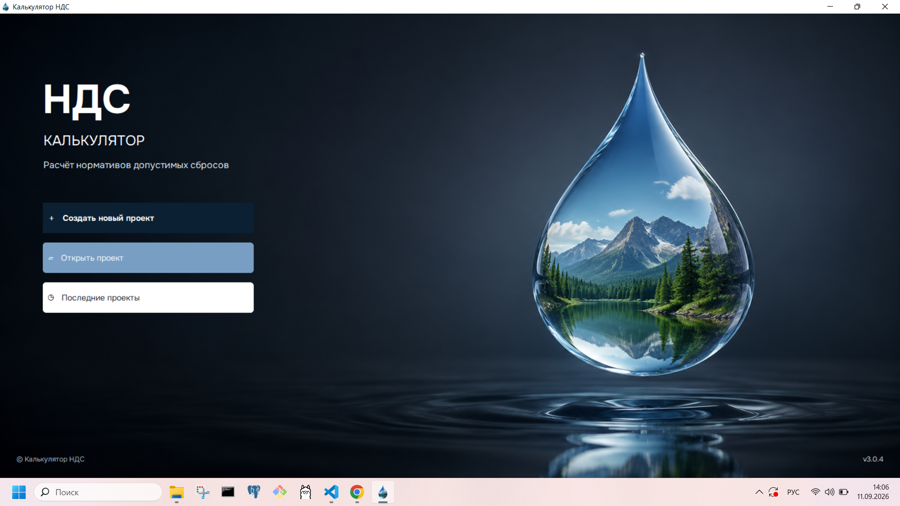
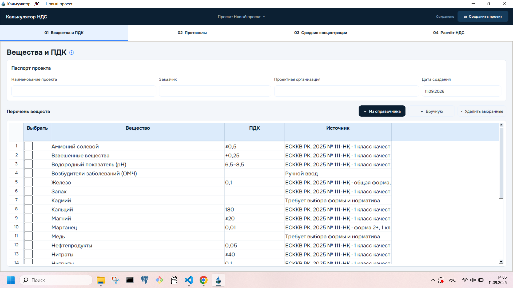
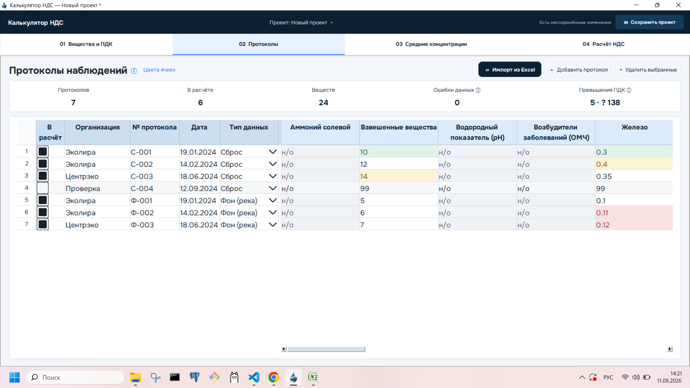
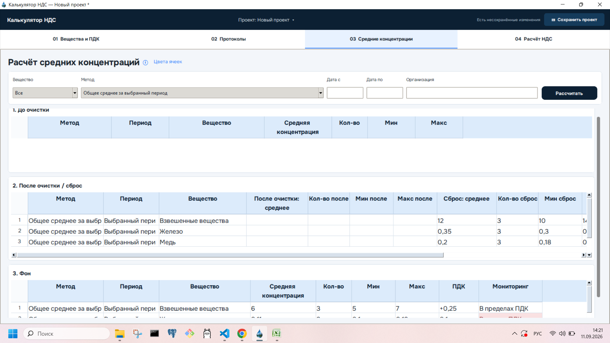
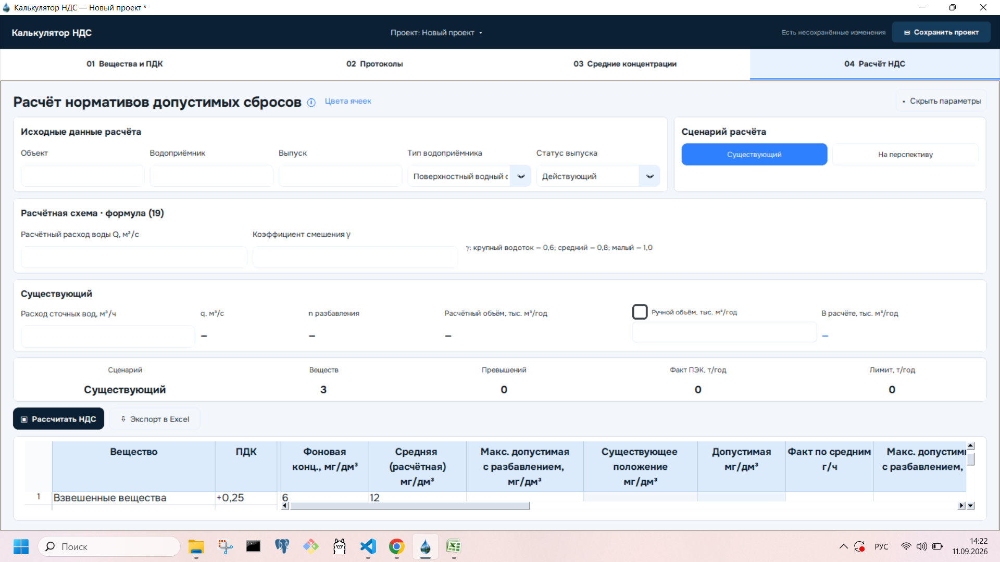

# Environmental NDS Calculator

Desktop application for automating environmental laboratory data processing
and regulatory discharge calculations.

> Commercial software project.
> The production source code is private. This repository is a public showcase
> containing screenshots, feature descriptions, architecture information,
> and synthetic examples only.

## Overview

The application was developed to replace repetitive manual calculations used
in environmental project work.

It allows non-technical users to create projects, import laboratory protocols,
validate measurements, calculate concentration statistics, apply regulatory
reference values, and generate NDS calculation results in a structured desktop
workflow.

## Main Workflow

1. Configure substances and regulatory limits
2. Import or enter laboratory protocols
3. Validate and process measurement data
4. Calculate average concentrations for selected periods
5. Perform NDS calculations
6. Export results to Excel

## Key Features

- Desktop GUI for non-technical users
- Project creation, saving, opening, and recent-project history
- Excel import and export
- Laboratory protocol management
- Input validation and error highlighting
- Regulatory reference values
- Multiple concentration averaging methods
- Minimum / maximum / average concentration analysis
- Environmental discharge calculations
- Existing and prospective calculation scenarios
- Offline operation
- Persistent project files
- Windows desktop packaging

## Technology

- Python
- Desktop GUI
- Excel processing
- Structured project storage
- Automated validation and calculation logic

## Application Screens

### Project Start Screen



### Substances and Regulatory Limits



### Laboratory Protocols



### Average Concentrations



### NDS Calculation



## Architecture

The application separates the user interface, project data, validation,
calculation logic, and Excel import/export workflows.

```text
Desktop GUI
    ↓
Project / Input Data
    ↓
Validation Layer
    ↓
Calculation Engine
    ↓
Results
    ↓
Excel Export
```
